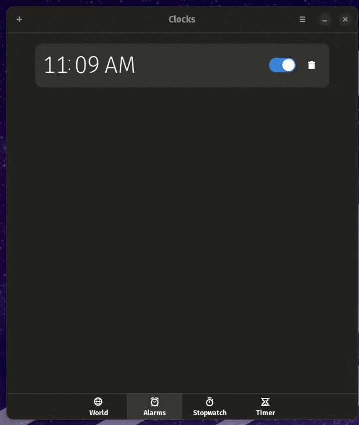

# Better GNOME Clocks

An enhanced version of GNOME Clocks with custom sound support, multiple timers, and improved user experience.

## ✨ Key Features

### 🎯 Multiple Timers (v1.1.0)
- **Create Multiple Timers**: Run multiple timers simultaneously, just like alarms
- **Named Timers**: Give each timer a custom name for easy identification
- **Sequential Ringing**: Timers ring one at a time in a queue system
- **Background Operation**: Timers continue running when app is closed
- **Quick Edit**: Click any stopped timer to edit duration and name
- **Inline Editing**: Edit timer names directly in the list
- **Empty State**: Clean UI with helpful prompts when no timers exist
- **Keyboard Shortcuts**: Press Enter to save in dialogs

### 🎵 Sound Management (v1.0.0)
- **Custom Timer Sounds**: Set your own sound file for timer completion
- **Custom Alarm Sounds**: Set your own sound file for alarms  
- **Continuous Sound Looping**: Both alarm and timer sounds loop until stopped
- **Sound Preferences**: Easy-to-use interface with preview functionality
- **Non-blocking Playback**: Sounds play in background without freezing UI
- **Fallback System**: Automatic fallback to system sounds if custom sound unavailable

### 🔔 Enhanced Notifications
- **Timer Ringing Modal**: Full-screen modal panel when timer completes
- **System Notifications**: Notifications with Stop button when window closed
- **Distinct Icons**: Different icons for timer vs alarm notifications
- **Visual Feedback**: Hover effects and smooth animations

## 📸 Screenshots & Demo

### 🎬 Demo


### 🕒 Multiple Timers


### ⏱️ Edit Timer


### 🔔 Timer Ringing


### 🎵 Custom Sound Settings


## Installation

### Dependencies

```bash
# Ubuntu/Debian
sudo apt install meson valac libgtk-4-dev libadwaita-1-dev \
    libgweather-4-dev libgnome-desktop-4-dev libgeoclue-2-dev \
    libgeocode-glib-dev gsound-dev

# Fedora
sudo dnf install meson vala gtk4-devel libadwaita-devel \
    libgweather4-devel gnome-desktop4-devel geoclue2-devel \
    geocode-glib-devel gsound-devel
```

### Building from Source

```bash
# Clone the repository
git clone <your-repo-url>
cd better-gnome-clocks

# Build
meson build
ninja -C build

# Install (optional)
sudo ninja -C build install

# Or run without installing
glib-compile-schemas build/data
env GSETTINGS_SCHEMA_DIR=build/data:/usr/share/glib-2.0/schemas \
    XDG_DATA_DIRS=build/share:/usr/share \
    ./build/src/gnome-clocks
```

## Usage

### Setting Custom Sounds

1. Open Better GNOME Clocks
2. Click the menu button (⋮) in the header bar
3. Select **Preferences**
4. Go to the **Sound** tab
5. Click **Choose File** for Timer or Alarm sound
6. Select your audio file (.ogg, .mp3, .wav)
7. Click **Preview** to test the sound
8. Close preferences - changes are saved automatically

### Using Timer with Modal

1. Go to **Timer** tab
2. Create a new timer
3. Start the timer
4. When timer completes:
   - Full-screen modal panel appears
   - Custom sound plays and loops continuously
   - Click **Stop** button to dismiss and stop sound

### Using Alarms

1. Go to **Alarms** tab
2. Create or edit an alarm
3. Set custom sound in preferences
4. When alarm triggers:
   - Sound loops continuously
   - Click **Stop** or **Snooze** to dismiss

## Technical Details

### Architecture Changes

**New Files:**
- `src/sound-manager.vala` - Manages custom sound paths and GSettings
- `src/timer-ringing-panel.vala` - Timer completion modal panel component
- `data/ui/timer-ringing-panel.ui` - Timer modal UI layout
- `data/ui/sound-settings.ui` - Sound preferences UI

**Modified Files:**
- `src/utils.vala` - Enhanced Bell class with custom sounds and continuous looping
- `src/timer-face.vala` - Integrated sound manager and ringing panel signals
- `src/alarm-face.vala` - Integrated custom sound support
- `src/preferences-dialog.vala` - Added sound settings tab
- `src/window.vala` - Added timer ringing panel display logic

### Sound Playback Implementation

- **Backend**: Direct `paplay` system calls for reliability
- **Threading**: GLib.Thread for non-blocking background playback
- **Looping**: do-while loop with cancellable checks
- **Cleanup**: pkill to terminate paplay processes on stop
- **Fallback**: Custom Sound → System Sound → GSound

### Signal Flow (Timer)

```
Timer Elapses
    ↓
timer-item emits ring()
    ↓
timer-face.ring_handler()
    ↓
Creates Bell with custom sound
    ↓
bell.ring() starts looping playback
    ↓
timer-face emits ring(Item)
    ↓
window.show_timer_ringing_panel()
    ↓
User clicks Stop
    ↓
timer.stop_timer_sound() → bell.stop()
    ↓
Sound stops, modal dismisses
```

## Differences from Original GNOME Clocks

1. **Custom Sounds**: Original only uses system sounds
2. **Continuous Looping**: Original may play once, this loops until stopped
3. **Timer Modal**: Original shows notification, this shows full-screen modal
4. **Sound Preferences**: New UI for managing custom sounds
5. **Background Playback**: Non-blocking audio using threads

## Credits

Based on GNOME Clocks by the GNOME Project.

Enhanced with custom sound support and improved UX.
